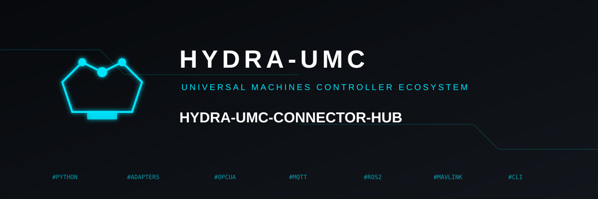

<p align="center">
  
</p>

# 🔌 HYDRA-UMC-CONNECTOR-HUB

<p align="center"><a href="README.md">🇺🇸 English</a> | <a href="README_spa.md">🇪🇸 Español</a> | <a href="README_fra.md">🇫🇷 Français</a> | 🇮🇹 <b>Italiano</b> | <a href="README_deu.md">🇩🇪 Deutsch</a> | <a href="README_zho.md">🇨🇳 简体中文</a> | <a href="README_jpn.md">🇯🇵 日本語</a></p>

### 🧩 Un registro dichiarativo e un validatore per adattatori di macchine esterne

<p align="center">
  
  
  
  
</p>

> **Stato: v0.0.6, scaffolding - Consegne 1-4 di 4 (schema/CLI/fixture,
> catalogo di sola lettura, cancello di sicurezza SDK, registri di
> certificazione).** `catalog`/`serve-catalog` sono reali e solo GET
> (non esiste alcuna rotta di scrittura di rete in nessuna parte di
> questo progetto); `gate` chiama direttamente il proprio `evaluate_job()`
> reale di HYDRA-UMC-SDK, mai una seconda implementazione di quel
> cancello (vedi
> [docs/CAPABILITY_GATE.md](docs/CAPABILITY_GATE.md)); `certify`
> registra un'evidenza reale attestata da un umano ma esplicitamente NON
> la verifica in modo indipendente contro hardware reale - vedi
> [docs/CERTIFICATION.md](docs/CERTIFICATION.md) per capire esattamente
> perché ciò resta fuori dall'ambito senza una macchina fisica a
> disposizione. Vedi [docs/CLI_REFERENCE.md](docs/CLI_REFERENCE.md) per
> la superficie di comandi esatta che esiste oggi.

---

## 1. 🛠️ PANORAMICA TECNICA

Oggi, scegliere e configurare quale bridge usa una data cella/macchina è
distribuito tra README, file `.env` e script ad-hoc in molti repository
di bridge reali. HYDRA-UMC-CONNECTOR-HUB è pensato per diventare l'unico
posto che risponde, per qualsiasi macchina esterna reale, a tre
domande: **quale protocollo parla, cosa può davvero fare
(leggere/scrivere/abortire, con quale rischio), e quale progetto reale
già esistente di questo ecosistema lo implementa già?**

Questa versione spedisce tutte e quattro le consegne previste:

1. **Un contratto reale e fisso** ([docs/ADAPTER_MANIFEST.md](docs/ADAPTER_MANIFEST.md)) -
   il "CONTRATO MINIMO DE ADAPTADOR" di questo
   ecosistema, con una regola non negoziabile già applicata nel
   codice: una capacità `write`/`abort` viene rifiutata a meno che non
   dichiari anche il proprio rischio, il permesso richiesto, lo stato di
   cella richiesto, il requisito di conferma umana e il timeout.
2. **Un vero validatore CLI** (`hydra-umc-connector-hub validate`) - un
   controllo strutturale scritto a mano (senza dipendenza
   `jsonschema`), così ogni errore reale nomina l'esatto
   adattatore/campo/capacità responsabile.
3. **Dieci fixture reali**, una per ogni progetto di bridge/protocollo
   già esistente in questo ecosistema - prova che il contratto non è
   teorico, e un modello di partenza per un nuovo manifesto adattatore.
4. **Un vero catalogo di sola lettura** (`catalog`/`serve-catalog`) -
   scopre ogni manifesto strutturalmente valido in una directory e, con
   `serve-catalog`, lo espone tramite un vero `http.server` solo GET
   (non esiste nessuna rotta di scrittura in nessuna parte di questo
   progetto).
5. **Una vera integrazione con il cancello di sicurezza di
   HYDRA-UMC-SDK** (`gate`) - una chiamata a una capacità
   `write`/`abort` è arbitrata dal proprio `evaluate_job()` reale
   dell'SDK, mai una seconda implementazione di quella logica; vedi
   [docs/CAPABILITY_GATE.md](docs/CAPABILITY_GATE.md).
6. **Veri registri di certificazione** (`certify`/`certifications`) -
   un registro reale, attestato da un umano e solo in aggiunta,
   verificato contro il proprio `evidenceSchema` di un adattatore; vedi
   [docs/CERTIFICATION.md](docs/CERTIFICATION.md) per capire perché
   verificare l'evidenza in modo indipendente contro hardware reale
   resta esplicitamente fuori dall'ambito qui.

```
$ hydra-umc-connector-hub validate fixtures/industrial-opcua.json
VALID fixtures/industrial-opcua.json adapterId='industrial-opcua' ownerProject='HYDRA-UMC-OPCUA-SERVER'

$ hydra-umc-connector-hub catalog --registry-dir fixtures | head -c 200
{"adapters": [{"adapterId": "cnc-grbl", "protocol": "grbl-serial", ...

$ hydra-umc-connector-hub gate fixtures/cnc-grbl.json --capability sendControlByte \
    --job-id j1 --idempotency-key i1 --source studio --cell-state READY --machine-state IDLE
{"allowed": true, "reason": "cell and external machine are ready", "evidenceErrors": []}

$ hydra-umc-connector-hub certify fixtures/cnc-grbl.json --machine-model "Genmitsu 3018-PROVer" \
    --certified-by "Juan Enrique" --evidence-file real-status.json --out-dir certifications/
CERTIFIED adapterId='cnc-grbl' certificationId='...' -> certifications/cnc-grbl__....json
```

Non esiste nessuna invocazione predefinita/senza argomenti né alcuna GUI
in nessuna parte di questo progetto - vedi
[docs/CLI_REFERENCE.md](docs/CLI_REFERENCE.md) per la superficie di
comandi completa e reale.

## 2. 🧱 ARCHITETTURA E DECISIONI DI DESIGN

- **Un validatore scritto a mano, non `jsonschema`.** Il proprio
  contratto della Consegna 1 è abbastanza piccolo (14 campi di primo
  livello, una forma di capacità annidata) perché una semplice funzione
  Python che raccoglie stringhe di errore reali e specifiche sia allo
  stesso tempo più semplice di un validatore JSON-Schema generico E
  produca un output più chiaro - ogni messaggio nomina l'esatto
  campo/indice responsabile, non un percorso di schema generico.
- **La regola di sicurezza write/abort è applicata nel codice, non nella
  documentazione.** `_WRITE_CAPABILITY_REQUIRED_FIELDS` in `schema.py` è
  quella regola esplicita trasformata in un controllo
  reale e testato - chi scrive un manifesto non può dimenticarla, perché
  il validatore rifiuta una capacità che lo fa.
- **`authenticationRef` viene controllato come un riferimento, mai
  accettato come testo libero.** Un insieme chiuso di veri prefissi
  (`env:`, `secret-store:`, `vault:`, `none:`) - deliberatamente non
  un'euristica "sembra un segreto" (vedi il proprio `log_redaction.py`
  di HYDRA-UMC-OPS-AGENT per capire perché un'euristica è lo strumento
  sbagliato anche qui per esattamente lo stesso problema).
- **Ogni errore viene raccolto, mai solo il primo.**
  `validate_adapter_manifest()` continua a controllare dopo aver trovato
  un problema - chi corregge un manifesto vede tutti i problemi reali in
  un'unica esecuzione.
- **Il catalogo è reale e di sola lettura, deliberatamente.**
  `registry.py` scansiona una directory senza ricorsione (così una
  `fixtures/invalid/` annidata non entra mai in un vero catalogo),
  scarta - ma continua a riportare - tutto ciò che fallisce
  `validate_adapter_manifest()`, e rifiuta due file che dichiarano lo
  stesso `adapterId`. `catalog_server.py` non ha nessun
  `do_POST`/`do_PUT` da nessuna parte - un tentativo di scrittura riceve
  il proprio `501` onesto di `BaseHTTPRequestHandler`, mai una rotta che
  questo progetto ha dimenticato di proteggere.
- **Il cancello di sicurezza riusa la vera logica di HYDRA-UMC-SDK, mai
  una seconda implementazione di essa.** Il
  `evaluate_capability_call()` di `sdk_gate.py` chiama direttamente
  `hydra_umc_sdk.bridge_contract.evaluate_job()` per ogni capacità
  `write`/`abort` - una capacità `read` non tocca mai l'SDK, poiché
  `evaluate_job()` è un cancello di movimento/scrittura, non un cancello
  di lettura. Vedi [docs/CAPABILITY_GATE.md](docs/CAPABILITY_GATE.md)
  per l'unica semplificazione deliberata e nominata che fa questa
  integrazione (un `JobPhase` sostitutivo unico per qualsiasi scrittura
  che non sia un abort).
- **Un registro di certificazione è onesto su cosa può e non può
  provare.** `certification.py` rifiuta di salvare una certificazione la
  cui evidenza non corrisponde all'`evidenceSchema` dell'adattatore, ma
  non afferma mai di verificare in modo indipendente che quell'evidenza
  provenga da hardware reale - non esiste in nessuna parte di questo
  progetto un percorso di codice che apra una vera porta seriale/sessione
  OPC-UA/connessione MQTT per verificarlo. Vedi
  [docs/CERTIFICATION.md](docs/CERTIFICATION.md).
- **Le dieci fixture nominano veri progetti proprietari, mai
  inventati.** Ogni `ownerProject` in `fixtures/*.json` è un vero
  repository di questo ecosistema (vedi la sezione Progetti Correlati) -
  questo è un vero modello di registro, non uno speculativo.
- **Solo libreria standard per il nucleo.**
  `validate`/`catalog`/`serve-catalog`/`certify`/`certifications` non
  richiedono alcuna dipendenza - `json`, Python semplice per i controlli
  strutturali, e `http.server`. Solo `gate` su una capacità
  `write`/`abort` richiede l'extra opzionale `[sdk]`.

## 📂 STRUTTURA DELLE DIRECTORY

```
HYDRA-UMC-CONNECTOR-HUB/
├── src/hydra_umc_connector_hub/
│   ├── schema.py            # Il vero contratto adapter-manifest + validatore strutturale + controllore di sottoinsieme JSON-Schema
│   ├── registry.py          # Consegna 2: scansiona una directory in un vero catalogo stabile e ordinato
│   ├── catalog_server.py    # Consegna 2: vero http.server solo GET che espone il catalogo
│   ├── sdk_gate.py          # Consegna 3: vera integrazione evaluate_job() di HYDRA-UMC-SDK
│   ├── certification.py     # Consegna 4: vero registro di certificazione solo in aggiunta, attestato da un umano
│   └── cli.py               # Punto di ingresso validate/catalog/serve-catalog/gate/certify/certifications
├── fixtures/                # Dieci veri manifesti adattatore validi (uno per ogni bridge esistente)
│   └── invalid/             # Cinque veri manifesti invalidi, ognuno che dimostra una ragione di rifiuto
├── tests/                   # Test reali: fixture, un vero http.server su una porta effimera, il vero hydra-umc-sdk installato, e un vero registro di certificazione in una directory temporanea
├── docs/
│   ├── ADAPTER_MANIFEST.md  # Il contratto reale completo, campo per campo
│   ├── CAPABILITY_GATE.md   # Il proprio contratto reale del cancello della Consegna 3 e la sua unica semplificazione nominata
│   ├── CERTIFICATION.md     # Il proprio contratto reale della Consegna 4 e la sua onesta lacuna di verifica hardware
│   └── CLI_REFERENCE.md     # Ogni sottocomando, le sue forme di output, il contratto dei codici di uscita
├── images/                  # Media e icone dell'app
├── tools/
│   ├── build_test.py        # Controllo di build/compilazione senza versionamento
│   └── ci_validate.py       # Validazione manifesto/CHANGELOG/docs usata dalla CI
├── build.sh / build.bat     # venv + installazione editabile + compile-check + test
├── build-test.sh / .bat     # Solo validazione di build, senza modificare nulla
├── run.sh / run.bat         # Demo reale: valida le dieci fixture (senza argomenti), oppure inoltra un vero comando CLI
├── bump_version.py          # Incremento tipo "odometro" dell'ecosistema (pyproject.toml + __init__.py)
└── bump_manifest_version.py # Sincronizza la versione di hydra-umc.project.json con quella nativa (--sync)
```

## ⚙️ COMPILAZIONE ED ESECUZIONE

```bash
chmod +x build.sh   # una tantum
./build.sh          # crea .venv, pip install -e ".[dev]", compile-check + test
./run.sh                                   # demo reale: valida le dieci fixture reali
./run.sh validate fixtures/industrial-opcua.json
./run.sh validate fixtures/invalid/*.json  # ognuna di queste dovrebbe riportare INVALID
./run.sh catalog --registry-dir fixtures
./run.sh serve-catalog --registry-dir fixtures --port 8801   # Ctrl+C per fermare
pip install -e ".[sdk]"                    # necessario solo per `gate` su una capacità write/abort
./run.sh gate fixtures/cnc-grbl.json --capability sendControlByte --job-id j1 \
    --idempotency-key i1 --source studio --cell-state READY --machine-state IDLE
./run.sh certify fixtures/cnc-grbl.json --machine-model "Genmitsu 3018-PROVer" \
    --certified-by "Il Tuo Nome" --evidence-file real-status.json --out-dir certifications/
```

Su Windows: `build.bat`, poi `run.bat` (stessa demo se chiamato senza
argomenti) / uno qualsiasi dei sottocomandi sopra. `build-test.sh`/`.bat`
esegue lo stesso controllo di compilazione (solo sintassi Python),
senza modificare nulla, che la propria CI di questo progetto esegue -
NON esegue da solo la suite di test; la CI esegue `pytest` come passo
separato, successivo. Esegui `./build.sh`/`build.bat` (o `pytest
tests/` direttamente) per la suite di test locale completa.

**Risoluzione dei problemi**

- `validate` riporta `INVALID` per un manifesto che credi corretto:
  leggi ogni motivo elencato - il validatore li riporta tutti, non solo
  il primo. Vedi [docs/ADAPTER_MANIFEST.md](docs/ADAPTER_MANIFEST.md)
  per il contratto esatto campo per campo.
- `validate` riporta `ERROR: ... is not valid JSON`: il file stesso è
  JSON malformato, distinto da un manifesto ben formato ma invalido -
  controlla una virgola o virgoletta mancante prima di controllare il
  contratto stesso.
- `catalog`/`serve-catalog` termina con codice `1` o elenca un file
  sotto `invalidFiles`: quel file ha fallito la validazione strutturale
  ed è stato deliberatamente lasciato fuori dal catalogo - esegui
  `validate` direttamente su di esso per l'elenco completo dei motivi.
- `gate` fallisce con `ERROR: the optional 'hydra-umc-sdk' package is
  not installed`: esegui prima `pip install -e ".[sdk]"` - necessario
  solo per una capacità `write`/`abort`.
- `gate`/`certify` fallisce con `ERROR: unknown cell_state ...` oppure
  `... does not match evidenceSchema`: vedi
  [docs/CAPABILITY_GATE.md](docs/CAPABILITY_GATE.md)/
  [docs/CERTIFICATION.md](docs/CERTIFICATION.md) per i valori/forme
  esatti attesi.

## 🚀 TABELLA DI MARCIA

Tutte e quattro le consegne del piano nominato nel proprio manifesto e
CHANGELOG di questo progetto spediscono ora codice reale e testato. Ciò
che resta, detto onestamente:

- **La lacuna di verifica hardware della Consegna 4 resta aperta
  deliberatamente.** `certify` registra un'evidenza attestata da un
  umano, verificata contro l'`evidenceSchema` proprio di un adattatore,
  ma nulla in questo progetto conferma in modo indipendente che
  quell'evidenza provenga davvero dalla macchina nominata - ciò richiede
  l'hardware fisico stesso, in una cella reale, che questa macchina di
  sviluppo non possiede. Vedi
  [docs/CERTIFICATION.md](docs/CERTIFICATION.md).
- **Integrazione con un vero client: iniziata, non finita.**
  HYDRA-UMC-SERVER ora interroga davvero `serve-catalog` -
  `GET /api/adapters` e `GET /api/adapters/:adapterId` inoltrano il vero
  catalogo di questo progetto, end-to-end (vedi il proprio
  `tools/verify_connector_hub_relay_contract.mjs` di HYDRA-UMC-SERVER,
  che avvia il vero `serve-catalog` di questo progetto contro i suoi
  veri `fixtures/` e una vera istanza di Server, mai un mock). È stato
  anche installato come un vero wheel in un venv al di fuori del proprio
  checkout di questo progetto ed eseguito da lì, confermando che il
  packaging stesso (non solo un'installazione editabile) funziona. Che
  Studio/Suite/Updater chiamino `gate` da soli resta un vero lavoro
  futuro, separato.
- **Manca un vero trasporto tra chi chiama `gate`/`certify` e lo stato
  reale della cella/macchina.** Oggi, `--cell-state`/`--machine-state`
  sono forniti da chi chiama come valori già noti - non esiste qui
  nessun percorso di codice che li recuperi dal vivo da
  HYDRA-UMC-SERVER o da un servizio di zone di sicurezza.

## 🔗 Progetti Correlati

Questo progetto fa parte dell'ecosistema robotico HYDRA-UMC dello stesso autore (JuanenRac / Electro Hobby 3D). Vale la pena conoscerlo, poiché una richiesta potrebbe in realtà riguardare uno di questi invece di questo repository.

**Direttamente Correlati**
- **[HYDRA-UMC-SDK](https://github.com/JuanenRac/HYDRA-UMC-SDK)** — il contratto JSON-Schema condiviso contro cui ogni bridge valida già i propri comandi; il comando `gate` di questo hub (Consegna 3) chiama direttamente il proprio `bridge_contract.evaluate_job()` reale per una capacità write/abort, mai una seconda implementazione di quel cancello.
- **[HYDRA-UMC-OPS-AGENT](https://github.com/JuanenRac/HYDRA-UMC-OPS-AGENT)** — un nuovo progetto affine: gestisce il ciclo di vita degli incidenti di manutenzione dei propri componenti di questo ecosistema, mentre questo hub scopre e valida cosa può fare una macchina/adattatore ESTERNO.
- **[HYDRA-UMC-GATEWAY-INDUSTRIAL](https://github.com/JuanenRac/HYDRA-UMC-GATEWAY-INDUSTRIAL)** — esplicitamente NON sostituito da questo progetto: GATEWAY-INDUSTRIAL è un vero relè di protocollo con la propria allowlist di comandi; questo hub è un registro/validatore dichiarativo che si colloca sopra di esso e sopra ogni altro bridge, mai una seconda implementazione di un protocollo.

**Fa Anche Parte dell'Ecosistema**

*Hardware e Piattaforma di Base*
- **[HYDRA-UMC](https://github.com/JuanenRac/HYDRA-UMC)** — la scheda madre fisica del braccio robotico: host CM5 + coprocessore STM32H745 dual-core, che coordina fino a 8 bracci utensile via CAN-OTA/SPI-OTA.
- **[HYDRA-UMC-OS](https://github.com/JuanenRac/HYDRA-UMC-OS)** — livello prodotto riproducibile su Raspberry Pi OS per il CM5: agente in sola lettura, config/profili validati, provisioning WiFi al primo contatto.

*Backend Centrale e Client*
- **[HYDRA-UMC-SERVER](https://github.com/JuanenRac/HYDRA-UMC-SERVER)** — il vero backend headless (REST/WebSocket) con cui parla davvero ogni client di controllo.
- **[HYDRA-UMC-STUDIO](https://github.com/JuanenRac/HYDRA-UMC-STUDIO)** — dashboard di controllo web con visualizzazione 3D multi-robot in tempo reale.
- **[HYDRA-UMC-SUITE](https://github.com/JuanenRac/HYDRA-UMC-SUITE)** — centro di comando sciame desktop (PySide6) per più server contemporaneamente.
- **[HYDRA-UMC-ANDROID-CONTROL](https://github.com/JuanenRac/HYDRA-UMC-ANDROID-CONTROL)** — app di controllo nativa per Android con login biometrico e un companion Wear OS abbinato.
- **[HYDRA-UMC-IOS-CONTROL](https://github.com/JuanenRac/HYDRA-UMC-IOS-CONTROL)** — app di controllo per iOS/iPadOS (Flutter) con sincronizzazione WebSocket in tempo reale.
- **[HYDRA-UMC-DSI](https://github.com/JuanenRac/HYDRA-UMC-DSI)** — interfaccia touch nativa per il touchscreen DSI da 7" a bordo, incorporata direttamente nel CM5.
- **[HYDRA-UMC-EDITOR-URDF](https://github.com/JuanenRac/HYDRA-UMC-EDITOR-URDF)** — creatore/editor grafico desktop di URDF che invia i modelli finiti al catalogo di STUDIO.
- **[HYDRA-UMC-BRIDGE-AMR](https://github.com/JuanenRac/HYDRA-UMC-BRIDGE-AMR)** — barriera di coordinamento per flotte AGV/AMR tramite un publisher MQTT VDA 5050 reale; il vero `ownerProject` dietro la propria fixture `mobile-vda5050` di questo hub.
- **[HYDRA-UMC-BRIDGE-CNC](https://github.com/JuanenRac/HYDRA-UMC-BRIDGE-CNC)** — coordinatore ad alto livello per celle CNC con accesso reale a stato/byte di controllo GRBL; dietro la propria fixture `cnc-grbl` di questo hub.
- **[HYDRA-UMC-BRIDGE-DROIDS](https://github.com/JuanenRac/HYDRA-UMC-BRIDGE-DROIDS)** — barriera di coordinamento per droidi con zampe/umanoidi, con un vero mittente di comandi per Boston Dynamics Spot.
- **[HYDRA-UMC-BRIDGE-LASER](https://github.com/JuanenRac/HYDRA-UMC-BRIDGE-LASER)** — coordinatore di sicurezza per celle laser che legge 3 salvaguardie GPIO reali di chiave/involucro/interblocco; dietro la propria fixture `laser-safety` di questo hub.
- **[HYDRA-UMC-BRIDGE-OPENPNP](https://github.com/JuanenRac/HYDRA-UMC-BRIDGE-OPENPNP)** — coordinatore ad alto livello sicuro per il flusso schede del pick-and-place OpenPnP; dietro la propria fixture `pnp-openpnp` di questo hub.
- **[HYDRA-UMC-BRIDGE-PRINTER3D](https://github.com/JuanenRac/HYDRA-UMC-BRIDGE-PRINTER3D)** — barriera di coordinamento sicura per stampanti 3D Moonraker/Klipper, con comandi di lavoro reali e controllati; dietro la propria fixture `printer-moonraker` di questo hub.
- **[HYDRA-UMC-BRIDGE-ROS2](https://github.com/JuanenRac/HYDRA-UMC-BRIDGE-ROS2)** — coordinatore di sicurezza con un vero trasporto ROS 2 rclpy, importato in modo lazy; dietro la propria fixture `robotics-ros2` di questo hub.
- **[HYDRA-UMC-BRIDGE-UAV](https://github.com/JuanenRac/HYDRA-UMC-BRIDGE-UAV)** — barriera di coordinamento per UAV dotati di fotocamera, con un vero mittente di comandi MAVLink; dietro la propria fixture `uav-mavlink` di questo hub.

*Piattaforma Strumenti URTC*
- **[URTC](https://github.com/JuanenRac/URTC)** — firmware per la scheda fisica dell'Universal Robot Tool Controller, oltre 25 profili utensile su bus CAN.
- **[URTC-FLASHER](https://github.com/JuanenRac/URTC-FLASHER)** — strumento desktop con GUI per il flashing delle schede URTC, CAN-OTA più SWD/JTAG a chip intero.
- **[URTC-TESTER](https://github.com/JuanenRac/URTC-TESTER)** — strumento desktop di diagnostica CAN-bus dal vivo per schede URTC, un pannello per profilo utensile.
- **[URTC-WEB-STUDIO](https://github.com/JuanenRac/URTC-WEB-STUDIO)** — alternativa basata su browser a URTC-TESTER tramite la Web Serial API, senza installazione locale.

*Nodo IA Visione (Hailo-8)*
- **[HYDRA-UMC-VISION-NODE](https://github.com/JuanenRac/HYDRA-UMC-VISION-NODE)** — hub di integrazione per la pipeline di visione Hailo-8, con un vero controllo di prontezza hardware per fase.
- **[HYDRA-UMC-DETECTION-HEF](https://github.com/JuanenRac/HYDRA-UMC-DETECTION-HEF)** — registro reale di modelli compilati con verifica di caricamento sicuro per architettura Hailo/checksum.
- **[HYDRA-UMC-VISION-STREAMER](https://github.com/JuanenRac/HYDRA-UMC-VISION-STREAMER)** — generatore reale di pipeline GStreamer + config MediaMTX, con una vera barriera di integrazione HailoRT.
- **[HYDRA-UMC-VISUAL-SERVOING-API](https://github.com/JuanenRac/HYDRA-UMC-VISUAL-SERVOING-API)** — vera legge di correzione Position-Based Visual Servoing, con cancello di sicurezza sullo stato di zona a monte.
- **[HYDRA-UMC-SAFETY-ZONES](https://github.com/JuanenRac/HYDRA-UMC-SAFETY-ZONES)** — vero controllo di violazione zona e richiesta E-STOP, con imposizione della freschezza di calibrazione.

*Nodo IA Cognitivo (Hailo-10)*
- **[HYDRA-UMC-COGNITIVE-NODE](https://github.com/JuanenRac/HYDRA-UMC-COGNITIVE-NODE)** — hub di integrazione per la pipeline cognitiva Hailo-10 (orchestrazione LLM/VLA/voce).
- **[HYDRA-UMC-VLA-ENGINE](https://github.com/JuanenRac/HYDRA-UMC-VLA-ENGINE)** — vera codifica/decodifica di token d'azione e generazione di traiettoria per un modello Vision-Language-Action.
- **[HYDRA-UMC-VOICE-UI](https://github.com/JuanenRac/HYDRA-UMC-VOICE-UI)** — vero front-end vocale (VAD + parser di intenti) con un relay verso Watch limitato e soggetto a conferma.
- **[HYDRA-UMC-SEMANTIC-PLANNER](https://github.com/JuanenRac/HYDRA-UMC-SEMANTIC-PLANNER)** — vera scomposizione dei task basata su regole e recupero semantico degli errori sui codici errore MCU.
- **[HYDRA-UMC-DOCS-QA](https://github.com/JuanenRac/HYDRA-UMC-DOCS-QA)** — vera ricerca documentale TF-IDF (solo libreria standard) sui documenti Markdown di questo ecosistema.

*Orchestrazione e Sciame*
- **[HYDRA-UMC-ORCHESTRATOR](https://github.com/JuanenRac/HYDRA-UMC-ORCHESTRATOR)** — hub di integrazione con un vero contratto di health-report gRPC/Protobuf e una macchina a stati di missione.
- **[HYDRA-UMC-JOB-DISPATCHER](https://github.com/JuanenRac/HYDRA-UMC-JOB-DISPATCHER)** — vera coda di lavori basata su priorità con deduplicazione, su una vera API HTTP.
- **[HYDRA-UMC-NODE-HEALING](https://github.com/JuanenRac/HYDRA-UMC-NODE-HEALING)** — vero watchdog di salute della flotta basato su gRPC, con retry/backoff e rilevamento di discrepanza d'identità.
- **[HYDRA-UMC-PATH-PLANNER-3D](https://github.com/JuanenRac/HYDRA-UMC-PATH-PLANNER-3D)** — vero pianificatore di percorsi 3D basato su RRT, con vera validazione delle collisioni ostacolo/spazio di lavoro.
- **[HYDRA-UMC-SWARM-SYNC](https://github.com/JuanenRac/HYDRA-UMC-SWARM-SYNC)** — vera sincronizzazione di stato CRDT LWW-Element-Map, con property test per la convergenza multi-cella.

*Gemello Digitale e Simulazione*
- **[HYDRA-UMC-TWIN](https://github.com/JuanenRac/HYDRA-UMC-TWIN)** — hub di integrazione per il motore di gemello digitale, con un vero contratto di sincronizzazione per compatibilità di versione.
- **[HYDRA-UMC-HIL-BRIDGE](https://github.com/JuanenRac/HYDRA-UMC-HIL-BRIDGE)** — vero interblocco di sicurezza hardware-in-the-loop che instrada i comandi tra simulazione e hardware reale.
- **[HYDRA-UMC-PHYSICS-REPLICA](https://github.com/JuanenRac/HYDRA-UMC-PHYSICS-REPLICA)** — vera cinematica diretta e validazione dei limiti articolari su un vero sottoinsieme URDF.
- **[HYDRA-UMC-SYNTHETIC-DATA-GEN](https://github.com/JuanenRac/HYDRA-UMC-SYNTHETIC-DATA-GEN)** — vero generatore procedurale di scene 2D con esportazione di annotazioni YOLO/COCO.

*Dati e Analisi*
- **[HYDRA-UMC-DATALAKE](https://github.com/JuanenRac/HYDRA-UMC-DATALAKE)** — vero archivio di serie temporali basato su sqlite3, con una vera API HTTP di ingestione/query.
- **[HYDRA-UMC-ANOMALY-DETECTOR](https://github.com/JuanenRac/HYDRA-UMC-ANOMALY-DETECTOR)** — vero rilevatore di anomalie FFT + baseline statistica, con monitoraggio della deriva.
- **[HYDRA-UMC-PRODUCTION-REPORTS](https://github.com/JuanenRac/HYDRA-UMC-PRODUCTION-REPORTS)** — vero calcolo OEE/disponibilità sullo storico di DATALAKE, con esportazione CSV riproducibile.
- **[HYDRA-UMC-TELEMETRY-COLLECTOR](https://github.com/JuanenRac/HYDRA-UMC-TELEMETRY-COLLECTOR)** — vera pipeline di ingestione CAN/WebSocket verso DATALAKE, con deduplicazione per sequenza.

*Gateway Industriale*
- **[HYDRA-UMC-OPCUA-SERVER](https://github.com/JuanenRac/HYDRA-UMC-OPCUA-SERVER)** — vero spazio di indirizzi OPC-UA, verificato con una vera sessione client del protocollo binario; il vero `ownerProject` dietro la propria fixture `industrial-opcua` di questo hub.
- **[HYDRA-UMC-MQTT-BROKER](https://github.com/JuanenRac/HYDRA-UMC-MQTT-BROKER)** — vero broker MQTT con autenticazione opzionale per client e ACL sui topic; dietro la propria fixture `industrial-mqtt` di questo hub.
- **[HYDRA-UMC-MTCONNECT-ADAPTER](https://github.com/JuanenRac/HYDRA-UMC-MTCONNECT-ADAPTER)** — veri endpoint XML `/probe` e `/current` di MTConnect, con output in modalità degradata; dietro la propria fixture `manufacturing-mtconnect` di questo hub.

*Operazioni dell'Ecosistema*
- **[HYDRA-UMC-UPDATER](https://github.com/JuanenRac/HYDRA-UMC-UPDATER)** — rileva, installa e aggiorna ogni checkout dell'ecosistema.
- **[HYDRA-UMC-OS-REBUILDER](https://github.com/JuanenRac/HYDRA-UMC-OS-REBUILDER)** — costruisce un'immagine CM5 nuova e completamente aggiornata.
- **[HYDRA-UMC-DEV-SERVER](https://github.com/JuanenRac/HYDRA-UMC-DEV-SERVER)** — host di sviluppo riproducibile (Raspberry Pi 5 / CM5) che conserva il codice sorgente dell'ecosistema ed esegue attività delimitate di build/test tramite una coda durevole; un ruolo di sviluppo dedicato, esplicitamente distinto da un CM5 operativo.
- **[HYDRA-UMC-DASHBOARD-AI](https://github.com/JuanenRac/HYDRA-UMC-DASHBOARD-AI)** — pannelli Smart Summaries e Anomaly Highlighting su DATALAKE/ANOMALY-DETECTOR, con un fallback statistico onesto.
- **[HYDRA-UMC-TOOL-CLI](https://github.com/JuanenRac/HYDRA-UMC-TOOL-CLI)** — CLI di flotta con un vero e stabile contratto di exit-code, un client live reale della stessa API di HYDRA-UMC-SERVER.
- **[HYDRA-UMC-WATCH](https://github.com/JuanenRac/HYDRA-UMC-WATCH)** — app companion WearOS con avvisi aptici reali e un relay vocale verso il telefono abbinato.
- **[URTC-SMART-RACK](https://github.com/JuanenRac/URTC-SMART-RACK)** — firmware per un rack di montaggio schede con decodifica reale dell'ID utensile e logica di preriscaldamento Smart Idle.
- **[URTC-VISION-TOOL](https://github.com/JuanenRac/URTC-VISION-TOOL)** — firmware più un vero companion di visione Python per una testa utensile di ispezione termica/RGB.

---

## 📚 Documentazione e Comunità

- **[docs/ADAPTER_MANIFEST.md](docs/ADAPTER_MANIFEST.md)** — il contratto reale completo, campo per campo, e perché `authenticationRef` è un riferimento.
- **[docs/CAPABILITY_GATE.md](docs/CAPABILITY_GATE.md)** — la propria integrazione reale della Consegna 3 con il cancello di sicurezza di HYDRA-UMC-SDK e la sua unica semplificazione nominata.
- **[docs/CERTIFICATION.md](docs/CERTIFICATION.md)** — il proprio contratto reale di registro di certificazione della Consegna 4 e la sua onesta lacuna di verifica hardware.
- **[docs/CLI_REFERENCE.md](docs/CLI_REFERENCE.md)** — ogni sottocomando, le sue forme di output, e il contratto dei codici di uscita.
- **[CONTRIBUTING.md](CONTRIBUTING.md)** — stack tecnologico e linee guida di codifica per una pull request.
- **[CODE_OF_CONDUCT.md](CODE_OF_CONDUCT.md)** — gli standard di comportamento attesi in questa comunità.
- **[SECURITY.md](SECURITY.md)** — come segnalare una vulnerabilità, e le reali aree di attenzione sulla sicurezza di questo progetto.
- **[SUPPORT.md](SUPPORT.md)** — dove porre domande e segnalare bug.

## 👤 AUTORE
**JuanenRac** (Electro Hobby 3D)
📧 electrohobby3d@gmail.com
📺 [youtube.com/@electrohobby3d](https://youtube.com/@electrohobby3d)

## 📜 LICENZA

GPL-3.0 (software) / CC BY-SA 4.0 (documentazione) - vedi [LICENSE.md](LICENSE.md).
